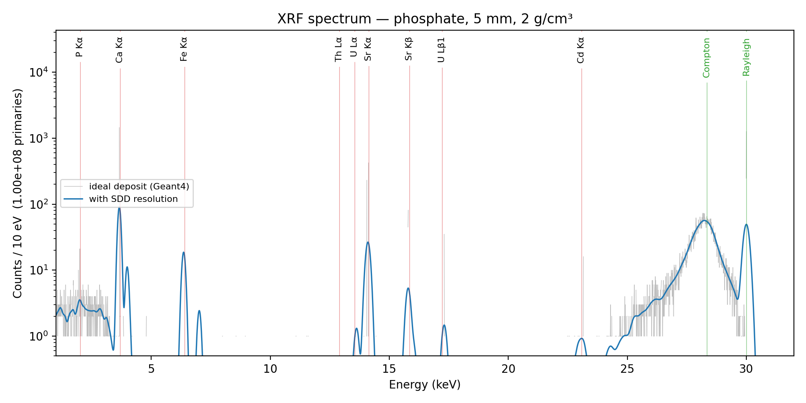
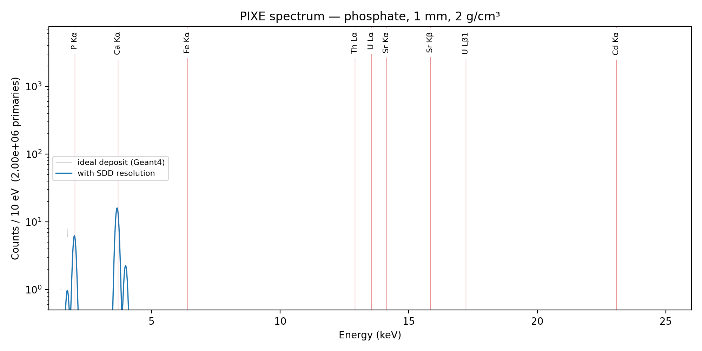
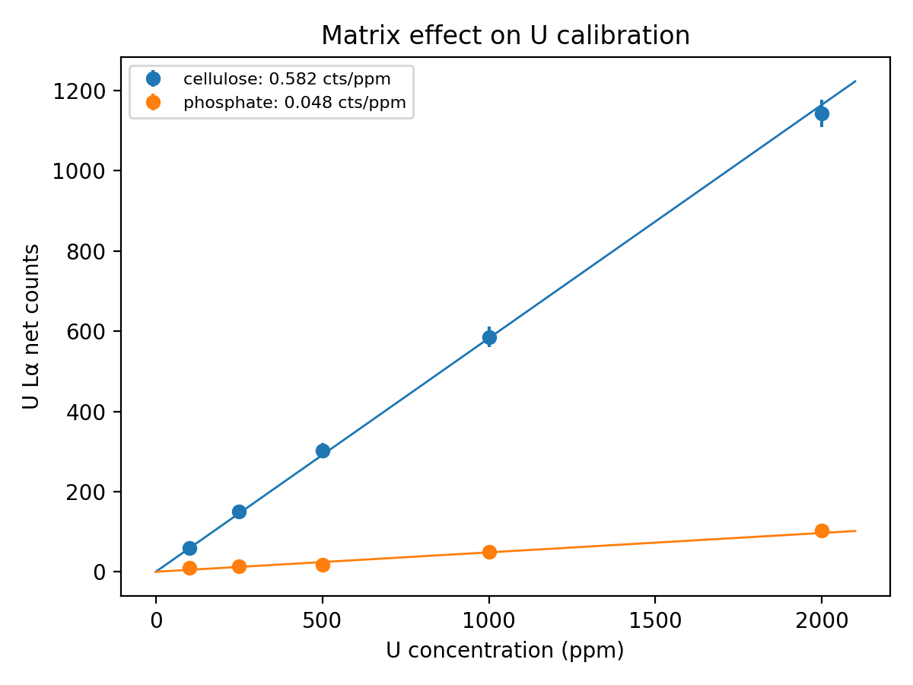
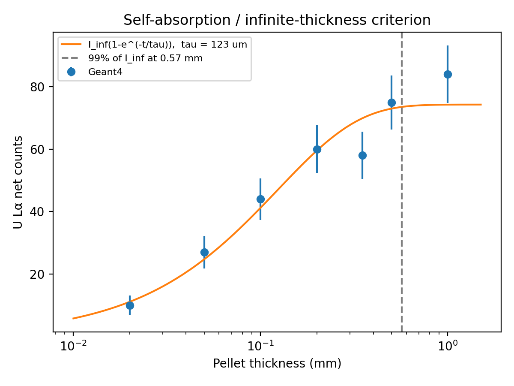
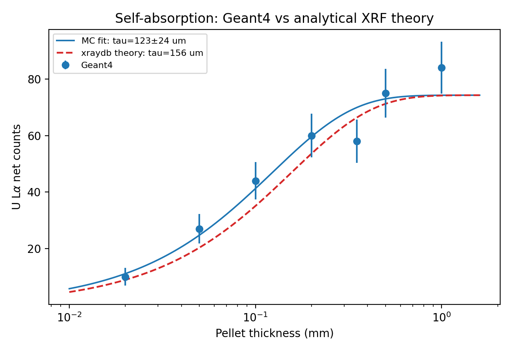

# xrf-phosphate — Monte Carlo radiation physics for the Moroccan phosphate chain

[](https://doi.org/10.5281/zenodo.22958737)

Geant4 models for two steps of the phosphate chain:

1. **Ore analysis:** XRF and PIXE of Khouribga phosphate rock, quantifying the matrix-absorption and
   self-absorption biases in trace-uranium assays, validated against analytical XRF theory.
2. **Waste radioprotection (`norm/`):** external gamma dose rate above a Jorf Lasfar phosphogypsum stack
   from the Ra-226 series, validated against the UNSCEAR dose-rate coefficient.

## Sample

Beneficiated **Khouribga (Morocco) phosphate rock**, measured composition from Ryszko, Rusek &
Kołodyńska (2023), *Materials* 16, 793, Table 5 (sample PR5), [doi:10.3390/ma16020793](https://doi.org/10.3390/ma16020793):
CaO 55.8, P₂O₅ 31.2, SiO₂ 5.77, F 4.07, SO₃ 2.36, Fe₂O₃ 2.31, Na₂O 0.60, Al₂O₃ 0.51, MgO 0.41, K₂O 0.13,
SrO 0.12 wt% (renormalised), with U 106 ppm and Cd 16 ppm. Pressed-pellet density 2.0 g/cm³.

## Setup

- 30 keV monochromatic photon beam, 45° incidence / 45° take-off (90° scattering geometry), vacuum.
- SDD-like Si detector (0.5 mm, ~50 mm²) behind a 12.5 µm Be window.
- Physics: `G4EmLivermorePhysics` with fluorescence, PIXE (ECPSSR), Rayleigh and Doppler-broadened Compton.
- Detector resolution (Fano + electronic noise) applied in post-processing.
- Each study point runs as an independent process with its own random seed.

## Results — ore analysis

### Spectra: XRF and PIXE are complementary



30 keV XRF (10⁸ photons) resolves Ca, Fe, Sr and the trace lines of U (Lα, Lβ1, 106 ppm) and Cd (Kα,
16 ppm); P Kα is fully absorbed by the matrix and Be window.



3 MeV PIXE (2×10⁶ protons) shows the light majors, including P Kα, which XRF misses, because protons
excite atoms close to the surface. The heavy traces are not detected at this proton fluence, consistent
with the steep fall of K-shell ionisation cross sections with Z at 3 MeV.

### 1. Matrix effect on uranium calibration



U Lα sensitivity is **0.048 ± 0.004** counts/ppm in phosphate rock versus **0.582 ± 0.013** counts/ppm in a
cellulose-binder standard (5 mm pellets, 2×10⁷ primaries per point): a **12-fold suppression**. Quantifying
phosphate ore against a cellulose calibration would report only **~8% of the true uranium content**,
showing why matrix-matched standards or fundamental-parameter corrections are essential.

### 2. Self-absorption and infinite-thickness criterion



U Lα intensity versus pellet thickness follows I∞(1 − e^(−t/τ)) with **τ = 123 ± 24 µm**, reaching 99% of
the infinite-thickness signal at ~0.6 mm. Pellets of **≥ 1 mm** are recommended for thickness-independent
trace-U measurements.

### 3. Validation against analytical XRF theory



The analytical thick-target attenuation depth, computed from tabulated mass-attenuation coefficients
(xraydb) for the same matrix and geometry, is **τ = 156 µm**. The Monte Carlo value agrees within
1.4σ (ratio 0.79), confirming that the transport model reproduces first-principles X-ray physics.

## Results — phosphogypsum radioprotection (`norm/`)

One Ra-226, Pb-214 or Bi-214 decay per event (secular equilibrium), with the full ENSDF gamma and X-ray
spectrum from Geant4 radioactive decay, uniform in a 150 m radius × 1 m stack; air kerma is scored at
1 m with a track-length estimator. Ra-226 activity of Jorf Lasfar phosphogypsum: 1097 Bq/kg
(Chem. Eng. Sci. 2023).

| Matrix | Dose-rate coefficient (nGy/h per Bq/kg) | Ratio to UNSCEAR (0.462) |
|---|---|---|
| Standard soil (Beck 1972), validation | 0.428 ± 0.004 | 0.93 |
| Phosphogypsum (CaSO₄·2H₂O) | 0.412 ± 0.004 | 0.89 |

- **Validation:** the soil coefficient agrees with UNSCEAR within 7%; the residual is explained by the
  finite simulated air volume (a 3× smaller domain gave 0.390) and by the U-238, Th-234, Pa-234m and
  Pb-210 members not included in the source.
- **Phosphogypsum** gives a ~4% lower coefficient than soil (stronger photoabsorption by Ca and S).
- **Jorf Lasfar stack:** **452 ± 4 nGy/h** at 1 m, i.e. **~0.63 mSv/y** external gamma dose for 2000 h/y
  of occupancy (0.7 Sv/Gy). Radon and dust inhalation are not included.

## Build and run (Geant4 ≥ 11.0)

```bash
mkdir build && cd build && cmake .. && make -j
./xrf macros/xrf.mac     # single spectrum
./xrf macros/pixe.mac    # 3 MeV proton PIXE
bash ../run_studies.sh   # matrix-effect + thickness studies
python ../analysis/analyze.py matrix out
python ../analysis/analyze.py thickness out
python ../analysis/validate_selfabsorption.py out   # requires: pip install xraydb
```

NORM model:
```bash
cd norm && mkdir build && cd build && cmake .. && make -j
NORM_BIG=1 NORM_MATRIX=soil ./norm macros/run.mac   # validation
NORM_BIG=1 NORM_MATRIX=pg   ./norm macros/run.mac   # phosphogypsum
```

Sample commands: `/xrf/sample/matrix`, `/xrf/sample/density`, `/xrf/sample/thickness`,
`/xrf/sample/ppm <El> <ppm>`, `/xrf/sample/clearTraces`.

## Limitations

- Monochromatic excitation; a realistic tube spectrum (e.g. from SpekPy) can be loaded with `/gps/ene/type Arb`.
- Trace-line statistics are limited; forced-detection variance reduction would reduce run times.
- Detector geometry is generic; matching a specific instrument would allow direct comparison with measurements.

## Author

Khaoula Younous — Mohammed V University, Rabat · ORCID [0009-0003-1492-6787](https://orcid.org/0009-0003-1492-6787)
